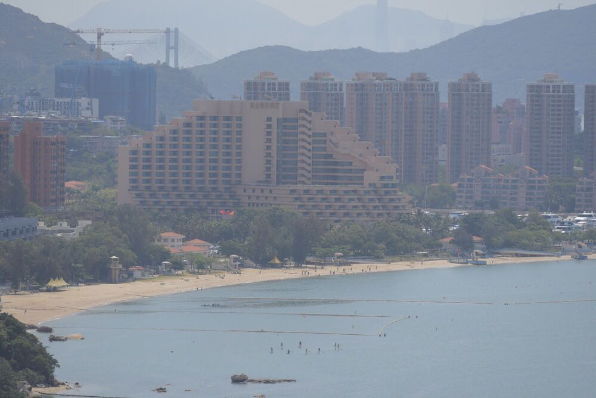
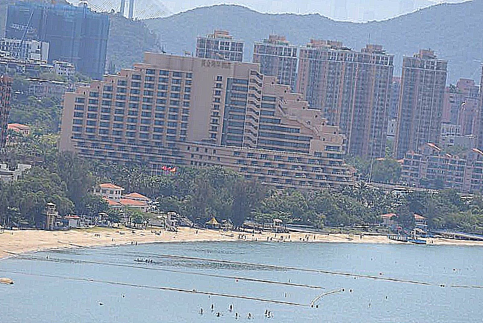
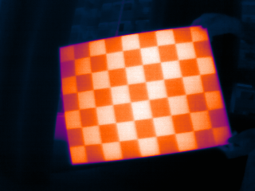
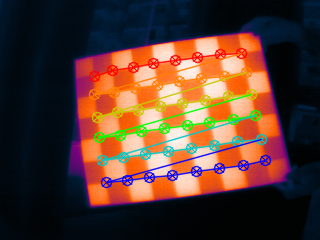
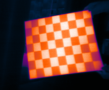

# Computer_Vision_technical_assessment
Refers to problem 1.1 and problem 1.2

## Results for Problem 1.1

Left is the original image and right is the rotated+contrast modified image

 

## Results for Problem 1.2

Left: Original image -> Middle: Chessboard corner detection image -> Right: Undistorted image

  

**Please look at the [result/problem1_2](https://github.com/ziimiin14/Computer_Vision_technical_assessment/tree/master/result/problem1_2) for remaining results.**

