# Computer_Vision_technical_assessment
Refers to problem 1.1 and problem 1.2

## Results for Problem 1.1

Left is the original image and right is the rotated+contrast modified image

 

## Results for Problem 1.2

Left: Original image -> Middle: Chessboard corner detection image -> Right: Undistorted image

  

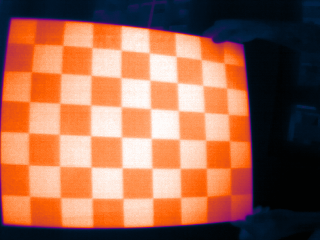 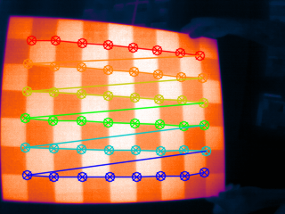 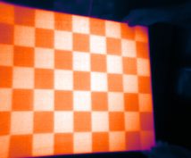

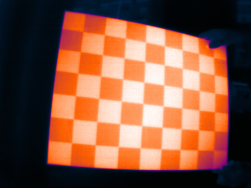 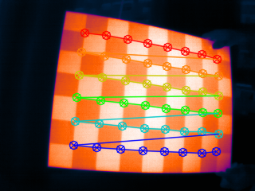 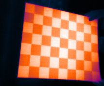

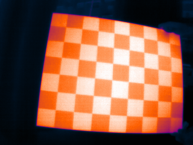 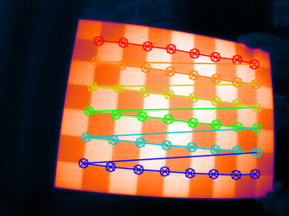 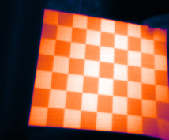

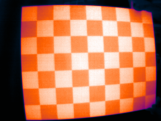 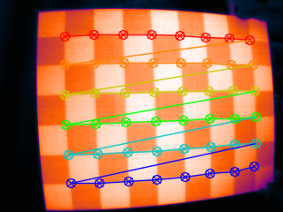 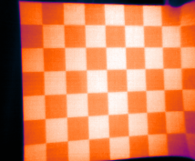

## Test
- run "python3 problem1_1.py" in your terminal for problem 1.1
- run "python3 problem1_2.py" in your terminal for problem 1.2

## Dependencies
- Python 3.6.9
- numpy == 1.16.2
- opencv-python == 4.3.0

